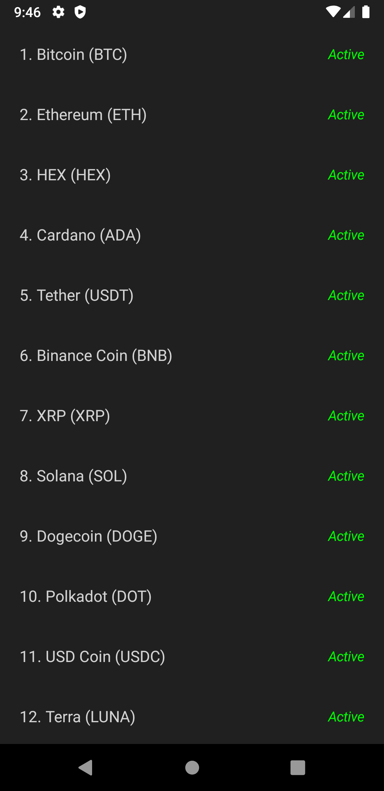

# Cryptocurrency Compose
This is a little app about Cryptocurrency that implemented with Jetpack Compose.

Using:
- Jetpack Compose
- Dark theme
- CLEAN architecture
- MVVM architectural pattern
- Coroutine Flow
- Hilt Dagger
- Navigation
- Retrofit

# Screenshots

  
  

Inspired by [Philipp Lackner project](https://github.com/philipplackner/CryptocurrencyAppYT)